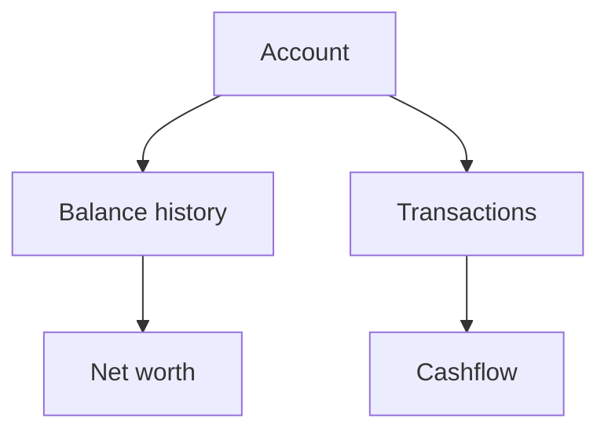

# Accounts

Accounts are the foundation of Whisper Money. They hold balances, transactions, and account history.

{{TOC}}

## Quick start

1. Create one account for each place where you keep or owe money.
2. Pick the account type that best matches the real account.
3. Add balances for accounts that are balance-only.
4. Import transactions for accounts that have day-to-day activity.
5. Review the Accounts page to see balances and net worth movement.

## Account map

## Account types

### Checking

Use this for everyday bank accounts.

Good for:

- Salary deposits
- Card payments
- Bill payments
- Daily spending

### Savings

Use this for cash you keep aside.

Good for:

- Emergency funds
- Short-term goals
- Money you do not spend daily

### Credit card

Use this for credit cards.

Credit cards are left out of net worth entirely. They are spending accounts, not
wealth, so the balance is tracked on the account itself and neither added to nor
subtracted from your total.

### Investment

Use this for broker or investment accounts.

These are usually balance-only accounts. You track value over time instead of daily transactions.

### Retirement

Use this for pension or retirement accounts.

Like investments, these usually focus on balance history and long-term growth.

### Loan

Use this for money you owe.

Examples:

- Mortgage
- Personal loan
- Student loan

Loans are the only account type that reduces net worth: the amount owed is
subtracted from your assets.

### Real estate

Use this for property value.

You can track market value and link a loan account when the property has a mortgage.

### Others

Use this when none of the other types fit.

Keep the name clear so you remember what the account represents.

## Transactional and balance-only accounts

Some accounts are best tracked with transactions. Others are best tracked with balances.

Use transactions for:

- Checking accounts
- Credit cards
- Savings accounts with regular movements

Use balances for:

- Investment accounts
- Retirement accounts
- Real estate
- Loans

## Balances, market values, and owed amounts

Whisper Money uses different words depending on the account type.

- Normal accounts use **balance**.
- Loan accounts use **owed amount**.
- Real estate accounts use **market value**.

This keeps the language closer to what the number means.

## Connected and manual accounts

You can track accounts manually or connect supported providers.

Manual accounts are good when:

- Your bank is not supported.
- You want full control.
- You only need occasional updates.

Connected accounts are good when:

- You want automatic transaction updates.
- You want less manual work.
- Your bank connection is available and healthy.

Only checking, savings, credit card, and other accounts can receive synced
transactions. Investment, retirement, real estate, and loan accounts are tracked
by value, so a connection updates their balance rather than filling a ledger.

Connecting a bank is part of the paid plan. Manual accounts, imports, and
everything built on top of them work without one.

The [integrations page](/integrations) lists every bank and app that can be
connected today.

## Archiving an account

Archive an account you no longer use instead of deleting it.

An archived account:

- Disappears from the accounts page and from every picker for new data.
- Keeps its transactions and its balance history, so past months keep the
  figures they already had.
- Can be brought back at any time from the Bank accounts settings.

Archiving is not the same as hiding an account from the dashboard. Hiding only
removes it from that one view; the account stays selectable everywhere else.

## Shared accounts

An account can record the share of it that is yours. A joint account held 50/50
contributes half of every amount to your own figures, while the account still
shows the real balance.

Use it for accounts you genuinely co-own, such as a shared household account or
a property owned with someone else.

## FAQ

### Why is my loan reducing net worth?

A loan is money owed. Whisper Money subtracts it from assets when calculating net worth.

### Why is my credit card not reducing net worth?

A credit card is a spending account, not wealth. Whisper Money tracks what you
owe on the card itself and leaves it out of the net worth total, so paying the
card off does not move that number.

### Why does real estate use market value?

The important number for property is its estimated value today. That value can change over time.

### Should I create one account or combine several?

Create separate accounts when the money is stored separately in real life. Reports are clearer that way.
