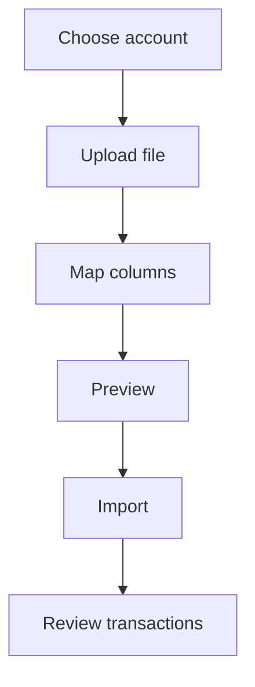

# Import transactions

Importing brings a bank file into Whisper Money when automatic syncing is not available for that bank, or when you would rather do it yourself.

{{TOC}}

## Quick start

1. Choose the account.
2. Upload the bank file.
3. Map the columns.
4. Check the preview.
5. Import selected transactions.
6. Review categories and duplicates after import.

## Import flow

The drawer opens on the file it needs.

## Required columns

Whisper Money reads the header row and guesses which column is which. The guesses are yours to correct, and the mapping is remembered per account for next time.

### Date

The transaction date.

Whisper Money can detect common date formats, but you can adjust it if needed.

### Description

The text that explains the transaction.

You can combine description columns when the bank splits details across fields.

### Amount

The transaction amount.

Make sure income and expenses use the correct sign.

### Balance

Optional.

Use this when the file includes running account balances.

## Balances and imports

Some files include a running balance column and some do not.

When the file has one, map it and the balance history follows the import. When it
does not, the import brings in the transactions only, and the account keeps
whatever balances you have entered yourself.

Working out the balance history from the transactions and one known balance is
not available yet. Until it is, set the balances yourself: a file of them can be
brought in from [Import balances](/documentation/accounts/import-balances), and a
single figure can be corrected in [Edit balances](/documentation/accounts/edit-balances).

## Preview before importing

Always review the preview. Rows that look like transactions you already have are
flagged and unticked for you, so importing the same file twice does not double
your history.

Look for:

- Rows flagged as duplicates that are actually two real payments of the same
  amount on the same day.
- Wrong dates.
- Amounts with the wrong sign.
- Duplicate transactions.
- Missing descriptions.
- Unexpected empty rows.

## Automation during import

Automation rules can help categorize imported transactions.

This works best when descriptions are consistent. If imported rows come from the same bank file format every time, rules become very useful.

## FAQ

### Which file should I use?

Use the cleanest export your bank provides. CSV and spreadsheet-style files are usually easiest.

### Why are amounts reversed?

Some banks export expenses as positive numbers. Check the preview before importing.

### Can I import the same file twice?

Yes. Before the preview, Whisper Money checks each row against the transactions
the account already has and flags the ones that match on the same day, amount,
and description. Flagged rows are unticked for you, so importing the file again
brings in only what is new. The count is shown above the preview, and you can
still tick a row back on if it is a genuine repeat payment.
