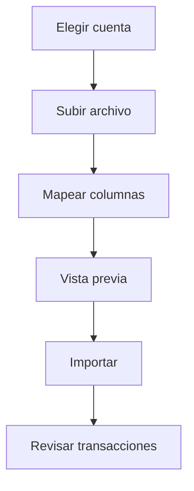

# Importar transacciones

Importar trae un archivo del banco a Whisper Money cuando la sincronización automática no está disponible para ese banco, o cuando prefieres hacerlo tú.

{{TOC}}

## Inicio rápido

1. Elige la cuenta.
2. Sube el archivo del banco.
3. Mapea las columnas.
4. Revisa la vista previa.
5. Importa las transacciones seleccionadas.
6. Revisa categorías y duplicados después de importar.

## Flujo de importación

El panel pregunta primero a qué cuenta pertenece el archivo, y después pide el archivo.

## Columnas necesarias

Whisper Money lee la fila de cabecera y adivina qué columna es cada cosa. Sus suposiciones son tuyas para corregirlas, y el mapeo se recuerda por cuenta para la próxima vez.

### Fecha

La fecha de la transacción.

Whisper Money puede detectar formatos comunes, pero puedes ajustarlo si hace falta.

### Descripción

El texto que explica la transacción.

Puedes combinar columnas de descripción cuando el banco separa detalles en varios campos.

### Importe

El importe de la transacción.

Asegúrate de que ingresos y gastos usan el signo correcto.

### Saldo

Opcional.

Úsalo cuando el archivo incluye saldos de cuenta acumulados.

## Saldos e importaciones

Algunos archivos incluyen una columna de saldo y otros no.

Cuando el archivo la tiene, mapéala y el historial de saldos acompaña a la
importación. Cuando no la tiene, la importación trae solo las transacciones, y la
cuenta conserva los saldos que hayas introducido tú.

Calcular el historial de saldos a partir de las transacciones y un saldo conocido
todavía no está disponible. Hasta que lo esté, pon los saldos tú: un archivo de
saldos se puede traer desde [Importar saldos](/documentation/accounts/import-balances),
y una cifra concreta se corrige en [Editar saldos](/documentation/accounts/edit-balances).

## Vista previa antes de importar

Revisa siempre la vista previa. Las filas que se parecen a transacciones que ya
tienes salen marcadas y desmarcadas, así que importar el mismo archivo dos veces
no duplica tu historial.

Busca:

- Filas marcadas como duplicadas que en realidad son dos pagos reales del mismo
  importe el mismo día.
- Fechas incorrectas.
- Importes con el signo equivocado.
- Transacciones duplicadas.
- Descripciones vacías.
- Filas vacías inesperadas.

## Automatización durante la importación

Las reglas de automatización pueden ayudar a categorizar transacciones importadas.

Funciona mejor cuando las descripciones son consistentes. Si siempre importas el mismo formato de archivo bancario, las reglas son muy útiles.

## Preguntas frecuentes

### ¿Qué archivo debería usar?

Usa la exportación más limpia que ofrezca tu banco. CSV y archivos tipo hoja de cálculo suelen ser los más fáciles.

### ¿Por qué los importes están invertidos?

Algunos bancos exportan gastos como números positivos. Revisa la vista previa antes de importar.

### ¿Puedo importar el mismo archivo dos veces?

Sí. Antes de la vista previa, Whisper Money compara cada fila con las
transacciones que ya tiene la cuenta y marca las que coinciden en el mismo día,
importe y descripción. Las filas marcadas se desmarcan por ti, así que volver a
importar el archivo trae solo lo nuevo. El número se muestra encima de la vista
previa, y puedes volver a marcar una fila si de verdad es un pago repetido.
