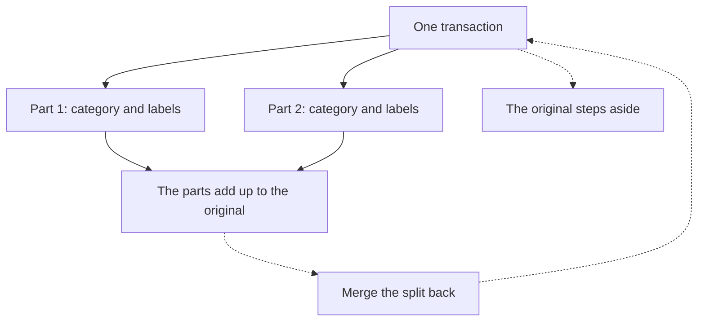

# Splitting a transaction

One payment is not always one thing. Splitting turns a single transaction into several, each with its own category and labels, that still add up to what the account really moved.

{{TOC}}

## Quick start

1. Find the transaction in your list.
2. Open its menu and choose **Split**.
3. Give each part a category, any labels, and its share of the amount.
4. Add more parts if you need them, up to twenty.
5. When it says everything has been shared out, split.

## What a split looks like

## When to split

A supermarket receipt that was mostly groceries and partly a birthday present. A
hardware store trip where half was for the flat and half for a client. A card
payment that covered dinner for four and got paid back in cash.

The point is always the same: the money left the account once, but it belongs in
more than one place in your reports. Splitting is how you say that without
inventing a transaction that never happened.

If the whole payment belongs in one category and you only wanted to mark part of
it, a [label](/documentation/labels) is usually the lighter answer. Split when
the _category_ differs.

## Sharing out the amount

Each row is one part: a category, any labels, and an amount. The counter at the
bottom tracks what is left to share out and refuses to let you finish until it
reaches zero.

Two rules keep a split honest, and the dialog enforces both:

- **The parts add up to the original.** Not roughly — exactly. When you are a
  few cents short, the link at the bottom hands the remainder to the last part
  in one click.
- **Every part moves money the same way.** Splitting an expense gives you parts
  that are all money out; splitting income gives you parts that are all money
  in. You cannot turn one payment into an expense and a refund.

A split needs at least two parts and takes at most twenty.

## What each part keeps, and what it does not

Every part inherits the date, the description, the account and the currency of
the original, so the split still reads as the thing that happened.

What is yours to set per part is the **amount**, the **category** and the
**labels**. Parts start out carrying the labels the whole transaction had, so
nothing is silently dropped; take them off part by part where they do not belong.

What stays behind is the bank's own reference. A part is a row Whisper Money
made, not something your bank sent, and it never pretends otherwise.

## Where the original goes

The original does not disappear and it is not deleted. It steps aside: it drops
out of your list, out of every total, and out of any budget that was counting
it, all at once. The parts take its place.

It keeps one thing while it sits there — the fingerprint your bank connection
recognises it by. That is what stops the next sync from cheerfully re-creating
the transaction you have just finished splitting.

## Living with a split

A part is marked in the list with a small split icon. Opening it shows what the
original was worth, what the other parts are, and the way back.

From there on the parts behave like any other transaction. They can be
recategorized, relabelled, filtered, budgeted and included in your cashflow.
There are only two things they will not do:

- **A part cannot be split again.** Merge the split back first, then split the
  original the way you meant to.
- **A part cannot be deleted on its own.** The rest would stop adding up to what
  the account actually moved, so a bulk delete containing parts is refused and
  tells you to merge first.

## Merging back

Merging puts the original back, with the category it had before, and removes the
parts. You can start it from any one of them.

It is worth being clear about the cost: **the category, labels and notes you set
on each part are lost.** The dialog lists exactly what is going away before you
confirm. If you only got one part wrong, edit that part instead of merging the
whole thing.

Merging always works, even for a transaction you split a long time ago.

## Splitting from your assistant

If you have connected Whisper Money to an AI assistant, splitting and merging
are available there too, with the same rules: the parts must add up, and they
must all move money the same way.

## Common mistakes

- **Looking for the original in the list.** It has stepped aside on purpose. The
  parts are what you see now, and the split icon on any of them shows what the
  original was worth.
- **Trying to delete one part.** Merge the split back, then delete the
  transaction.
- **Splitting to mark a portion of a payment.** If the category is the same for
  the whole payment, a label does the job with less to undo later.
- **Splitting income and expense out of one transaction.** A refund is a
  transaction of its own, not a part of the payment it refunds.

## FAQ

### Does splitting change my account balance?

No. The parts add up to the original, so every total, every report and every
balance lands exactly where it did before.

### Do budgets follow the parts?

Yes. The original leaves whatever budget was tracking it, and each part joins
the budget that matches its own category or labels.

### Can I split a transaction I created by hand?

Yes. Splitting works the same whether the transaction came from your bank, from
an import, or from you.

### What happens if my bank re-sends the transaction I split?

Nothing. The original keeps the fingerprint the sync matches on, so it is
recognised as already there and no duplicate appears.

### Can I change how much each part is worth afterwards?

Not directly — the amounts are what make the split add up. Merge it back and
split it again with the amounts you want.
