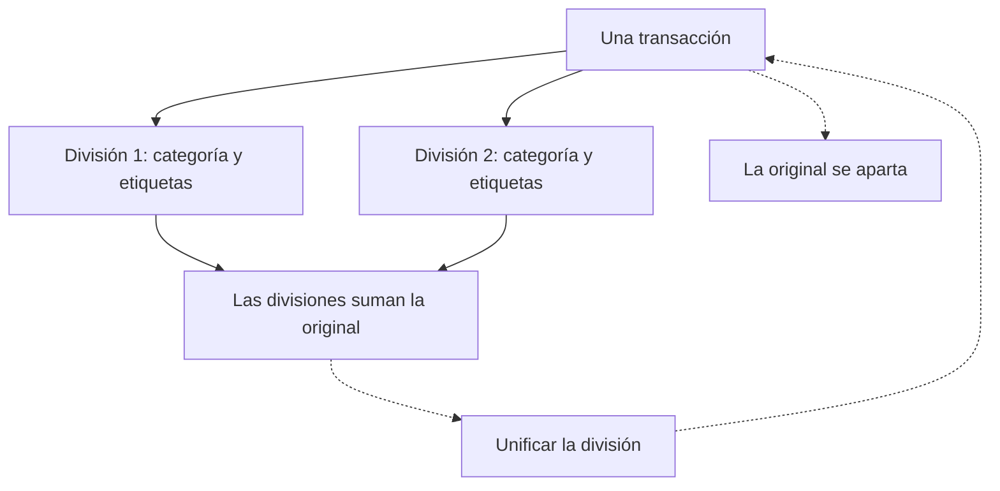

# Dividir una transacción

Un pago no siempre es una sola cosa. Dividir convierte una transacción en varias, cada una con su categoría y sus etiquetas, que siguen sumando lo que realmente se movió en la cuenta.

{{TOC}}

## Inicio rápido

1. Busca la transacción en tu lista.
2. Abre su menú y elige **Dividir**.
3. Da a cada división una categoría, las etiquetas que quieras y su parte del importe.
4. Añade más divisiones si las necesitas, hasta veinte.
5. Cuando indique que está todo repartido, divide.

## Cómo es una división

## Cuándo dividir

Un ticket del supermercado que fue sobre todo compra y en parte un regalo de
cumpleaños. Una visita a la ferretería en la que la mitad era para casa y la
mitad para un cliente. Un pago con tarjeta que cubrió la cena de cuatro y te
devolvieron en efectivo.

La idea siempre es la misma: el dinero salió de la cuenta una vez, pero pertenece
a más de un sitio en tus informes. Dividir es la forma de decirlo sin inventarte
una transacción que nunca ocurrió.

Si todo el pago pertenece a una sola categoría y solo querías marcar una parte,
una [etiqueta](/documentation/labels) suele ser la respuesta más ligera. Divide
cuando lo que cambia es la _categoría_.

## Repartir el importe

Cada fila es una división: una categoría, las etiquetas que quieras y un
importe. El contador de abajo lleva la cuenta de lo que queda por repartir y no
te deja terminar hasta que llega a cero.

Dos reglas mantienen honesta una división, y el diálogo hace cumplir las dos:

- **Las divisiones suman la original.** No aproximadamente: exactamente. Cuando
  te faltan unos céntimos, el enlace de abajo le da el resto a la última
  división de un clic.
- **Todas las divisiones mueven el dinero en el mismo sentido.** Al dividir un
  gasto salen divisiones que son todas dinero que sale; al dividir un ingreso,
  todas dinero que entra. No puedes convertir un pago en un gasto y una
  devolución.

Una división necesita al menos dos partes y admite como máximo veinte.

## Qué conserva cada división y qué no

Cada división hereda la fecha, la descripción, la cuenta y la moneda de la
original, así que el conjunto sigue leyéndose como lo que pasó.

Lo que decides tú en cada una es el **importe**, la **categoría** y las
**etiquetas**. Las divisiones nacen con las etiquetas que llevaba la transacción
entera, para que no se pierda nada sin avisar; quítalas una a una donde no
correspondan.

Lo que se queda atrás es la referencia del propio banco. Una división es una fila
que crea Whisper Money, no algo que enviara tu banco, y nunca finge lo contrario.

## Dónde va la original

La original no desaparece ni se borra. Se aparta: sale de tu lista, de todos los
totales y de cualquier presupuesto que la estuviera contando, todo a la vez. Las
divisiones ocupan su lugar.

Mientras está ahí conserva una cosa: la huella por la que la reconoce tu conexión
bancaria. Eso es lo que evita que la siguiente sincronización vuelva a crear
tan campante la transacción que acabas de dividir.

## Convivir con una división

Una división se marca en la lista con un pequeño icono. Al abrirlo ves cuánto
valía la original, cuáles son las demás divisiones y el camino de vuelta.

A partir de ahí las divisiones se comportan como cualquier otra transacción: se
recategorizan, se reetiquetan, se filtran, entran en presupuestos y cuentan en tu
flujo de caja. Solo hay dos cosas que no hacen:

- **Una división no se puede volver a dividir.** Unifica primero y divide después
  la original como querías.
- **Una división no se puede borrar por su cuenta.** Las demás dejarían de sumar
  lo que la cuenta movió de verdad, así que un borrado masivo que incluya
  divisiones se rechaza y te pide unificarlas antes.

## Unificar

Unificar devuelve la original, con la categoría que tenía antes, y elimina las
divisiones. Puedes empezar desde cualquiera de ellas.

Conviene tener claro el precio: **se pierden la categoría, las etiquetas y las
notas de cada división.** El diálogo lista exactamente lo que desaparece antes de
confirmar. Si solo te has equivocado en una división, edita esa división en lugar
de unificarlo todo.

Unificar funciona siempre, incluso con una transacción que dividiste hace mucho.

## Dividir desde tu asistente

Si has conectado Whisper Money a un asistente de IA, dividir y unificar también
están disponibles allí, con las mismas reglas: las divisiones tienen que sumar la
original y todas tienen que mover el dinero en el mismo sentido.

## Errores habituales

- **Buscar la original en la lista.** Se ha apartado a propósito. Ahora lo que
  ves son las divisiones, y el icono de cualquiera de ellas te dice cuánto valía
  la original.
- **Intentar borrar una sola división.** Unifica y borra después la transacción.
- **Dividir para marcar una parte de un pago.** Si la categoría es la misma para
  todo el pago, una etiqueta hace el trabajo y deja menos que deshacer.
- **Sacar un ingreso y un gasto de una misma transacción.** Una devolución es una
  transacción propia, no una parte del pago que devuelve.

## Preguntas frecuentes

### ¿Dividir cambia el saldo de mi cuenta?

No. Las divisiones suman la original, así que todos los totales, todos los
informes y todos los saldos quedan exactamente donde estaban.

### ¿Los presupuestos siguen a las divisiones?

Sí. La original sale del presupuesto que la seguía y cada división entra en el
presupuesto que corresponda a su categoría o a sus etiquetas.

### ¿Puedo dividir una transacción creada a mano?

Sí. Dividir funciona igual venga la transacción de tu banco, de una importación o
de ti.

### ¿Qué pasa si mi banco vuelve a enviar la transacción que dividí?

Nada. La original conserva la huella con la que la sincronización la reconoce,
así que se detecta como ya existente y no aparece ningún duplicado.

### ¿Puedo cambiar después cuánto vale cada división?

Directamente no: los importes son lo que hace que la división cuadre. Unifícala y
vuelve a dividirla con los importes que quieras.
