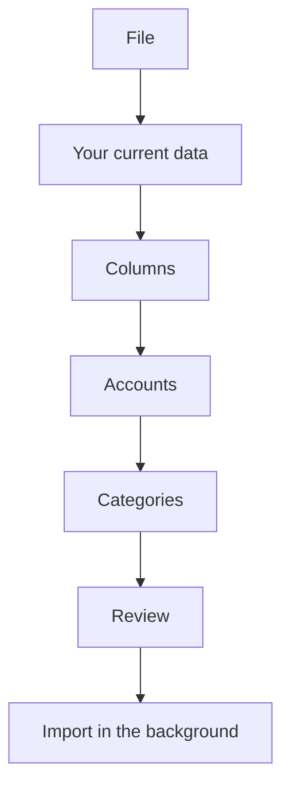

# Import from another app

Coming from another finance app? Bring its whole export over in one go: your accounts, your categories with their subcategories, every transaction with its notes, and the daily balances when the file has them.

{{TOC}}

## Quick start

1. Open **Settings → Import from another app**, or **Coming from another app?** on the accounts step while you set up your account.
2. Say where you are coming from and upload the file.
3. Check the columns.
4. Decide what happens to each account.
5. Check the categories.
6. Review and import. It runs in the background, so you can close the tab.

## When you can use it

The full import is for moving in, not for every day. You can start one:

- While you are setting up your account.
- During the 15 days after you finish setting it up. The Settings page shows how many days are left.
- After that, on request: write to us and we can open it for your account.

Once those days are over, the Settings page stays for as long as you have an
import you can still undo. To bring a bank statement into one account at any
time, use [Import transactions](/documentation/transactions/import) instead.

## What your file needs

One file, exported from your previous app or kept by you:

- CSV, XLS, XLSX or Numbers, up to 10 MB.
- One row per transaction.
- A date, an amount in a single column with expenses negative, and a description.
- A column saying which account each row belongs to. Without one, every row goes
  into a single account named after the file.

Your browser reads the file. Nothing is saved until you confirm the last step,
and only the columns you map are imported.

Coming from Banktrack? Its export is recognized and filled in for you: see
[Import from Banktrack](/documentation/import-from-another-app/banktrack).

## The import, step by step

### 1. File

Pick where you are coming from: **Banktrack**, or **Another app or my own
spreadsheet**. Then upload the file. A Banktrack export is recognized by its
headers whichever you picked, and its columns are filled in for you.

### 2. Your current data

This step only appears when your space already has accounts.

- **Add to what I have** keeps everything. In the accounts step you can send a
  file account into one of your manual accounts, and the transactions it already
  has are skipped.
- **Start from scratch** deletes your manual accounts, with their transactions
  and balances, before importing. Your categories, labels and rules stay, and so
  do your connected accounts. It cannot be undone.

A connected account is never touched either way. If the file has transactions
from it, they go into a new manual account, so they never mix with the ones the
bank sends.

### 3. Columns

Each piece of a transaction comes from one column of your file. Whisper Money
guesses what it can, you correct the rest, and the choice is remembered for the
next file from the same app.

### Required

- **Date**, with its format.
- **Amount**, signed as in the file: a negative amount is an expense.
- **Description**.
- **Account**: each different value becomes an account. Choose **All rows are
  one account** when the file has no such column.

### Optional

- **Category**, with the **subcategory separator**: `Home, Repairs` becomes
  Home › Repairs, up to three levels.
- **Balance**, for the daily balances.
- **Notes**, **Currency**, **IBAN**.
- **Transaction ID**, so importing the file again duplicates nothing.
- **Ignored**, for rows the other app left out of its totals.

Below the columns, a preview shows how the first transactions will look. Rows
that cannot be read are listed with the reason, blank rows are skipped, and the
columns you leave unmapped are named so you know what stays behind.

### 4. Accounts

Every account in the file is listed with its transactions, its dates and the
balances it carries. For each one, choose:

- **Create new account**.
- **Add to one of my accounts**: one of your manual accounts. A file account
  with the same name as one of them goes there by default.
- **Merge with another from the file**.
- **Don't import**.

The name, the type (checking, savings, credit card or others), the currency and
the bank can all be changed. The bank is looked up by name; when our list has no
match, a bank of your own is created with the name from the file. Cash accounts
get no bank. An IBAN is saved on the account, unless the file only shows part of
it.

### 5. Categories

Each category in the file is matched against yours by name. The ones you
already have are merged, names that only look alike are flagged **Similar,
review it**, and the rest are created with their subcategories. You can send any
of them into one of your categories instead.

Transfers get their own section:

- Transfers between your own accounts (Banktrack calls them "Traspasos Propios")
  go to your **Own account** transfer category.
- Rows the other app marked as ignored go to a transfer category, **Other
  transfers** unless you pick another, so they count as neither spending nor
  income.

### 6. Review

A summary of what will be created: new accounts, new categories, transactions
and daily balances. When transactions go into accounts you already have, it says
how many are new and about how many are already there. If you chose to start from
scratch, you confirm the deletion here.

### 7. Import

The import runs in the background. You can close the tab and come back later:
the progress is waiting in Settings.

## After the import

- **Transactions without a category.** On the paid plan, and if you have agreed
  to AI categorization, the AI categorizes them. While you are still setting up your
  account, the setup's own AI step takes care of them. Otherwise they wait for
  you in Transactions.
- **Automation rules** run on what arrives, but never replace a category the file
  brought.
- **Duplicates.** Importing the same file again creates nothing new: a row is
  skipped when its transaction ID, or its date, amount and description, match a
  transaction the account already had. Two identical rows inside the same file
  are both kept, as two real payments.
- **Balances** are only imported when the file has a balance column, and only for
  the accounts with values in it. In an account you already had, they fill the
  days that had no balance and never overwrite one you entered.

## Undo an import

Every import is listed in **Settings → Import from another app**, with an
**Undo** button.

Undoing removes everything the import created: the accounts, with all their
transactions and balances, including anything you added to them afterwards; the
categories and banks; and the transactions and balances it added to accounts you
already had. Your own accounts stay. It runs in the background, and the list
shows "Undoing…" until it finishes.

An imported account that you have since connected to your bank stays, without
the imported transactions. What **Start from scratch** deleted before the
import cannot be brought back.

## FAQ

### How is this different from importing transactions?

[Import transactions](/documentation/transactions/import) brings one bank
statement into one account, and is always available. The full import reads a
whole export with many accounts, creates the accounts and categories, and is
open during your first days.

### My file has no account column. Can I still use it?

Yes. Choose **All rows are one account** in the Account field and everything
goes into one account named after the file. For several accounts, import one
file per account.

### What is not imported?

Only the columns you map come in. Budgets, rules, attachments and anything else
that is not a transaction stay in the other app.

### My 15 days are over. Can I still import?

Write to us and we can open the full import for your account. Bank statements
can be imported at any time with [Import transactions](/documentation/transactions/import).

### Can I import a newer export later?

Yes, while the full import is open to you. Transactions you already imported are
skipped, so only the new ones come in.
