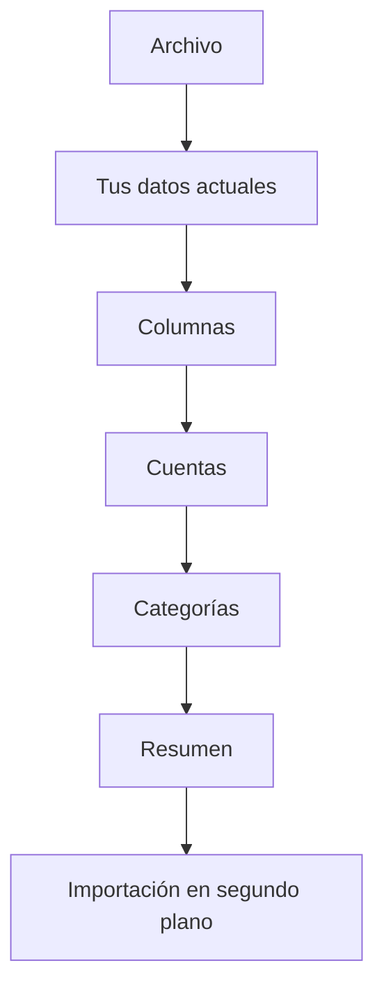

# Importar desde otra app

¿Vienes de otra app de finanzas? Trae su exportación entera de una vez: tus cuentas, tus categorías con sus subcategorías, cada transacción con sus notas y los saldos diarios cuando el archivo los incluye.

{{TOC}}

## Inicio rápido

1. Abre **Configuración → Importar desde otra app**, o **¿Vienes de otra app?** en el paso de cuentas mientras configuras tu cuenta.
2. Indica de dónde vienes y sube el archivo.
3. Revisa las columnas.
4. Decide qué pasa con cada cuenta.
5. Revisa las categorías.
6. Revisa el resumen e importa. Se hace en segundo plano, así que puedes cerrar la pestaña.

## Cuándo puedes usarla

La importación completa sirve para mudarte, no para el día a día. Puedes empezar una:

- Mientras configuras tu cuenta.
- Durante los 15 días siguientes a terminar de configurar tu cuenta. La página de Configuración te dice cuántos días te quedan.
- Después, bajo petición: escríbenos y te la abrimos para tu cuenta.

Pasados esos días, la página de Configuración sigue ahí mientras tengas alguna
importación que todavía se pueda deshacer. Para traer el extracto de un banco a
una cuenta en cualquier momento, usa [Importar transacciones](/documentation/transactions/import).

## Qué necesita tu archivo

Un único archivo, exportado de tu app anterior o hecho por ti:

- CSV, XLS, XLSX o Numbers, de hasta 10 MB.
- Una fila por transacción.
- Una fecha, un importe en una sola columna con los gastos en negativo y una descripción.
- Una columna que diga a qué cuenta pertenece cada fila. Si no la tiene, elige
  **Todas las filas son de una sola cuenta** y todas van a una sola cuenta con el
  nombre del archivo.

El archivo lo lee tu navegador. No se guarda nada hasta que confirmas el último
paso, y solo se importan las columnas que asignas.

¿Vienes de Banktrack? Su exportación se reconoce y se rellena sola: mira
[Importar desde Banktrack](/documentation/import-from-another-app/banktrack).

## La importación, paso a paso

### Archivo

Elige de dónde vienes: **Banktrack**, u **Otra app o un Excel propio**. Después
sube el archivo. Una exportación de Banktrack se reconoce por sus cabeceras elijas
lo que elijas, y sus columnas se rellenan solas.

### Tus datos actuales

Este paso solo aparece cuando ya tienes cuentas en tu espacio.

- **Añadir a lo que ya tengo** lo conserva todo. En el paso de cuentas puedes
  mandar una cuenta del archivo a una de tus cuentas manuales, y las
  transacciones que ya tenga se saltan.
- **Empezar de cero** borra tus cuentas manuales, con sus transacciones y sus
  saldos, antes de importar. Tus categorías, etiquetas y reglas se quedan, y tus
  cuentas conectadas también. No se puede deshacer.

Una cuenta conectada no se toca en ningún caso. Si el archivo trae transacciones
suyas, van a una cuenta manual nueva, para que nunca se mezclen con las que
envía el banco.

### Columnas

Cada dato de una transacción sale de una columna de tu archivo. Whisper Money
adivina lo que puede, tú corriges el resto, y lo recuerda para el próximo archivo
de la misma app.

### Obligatorios

- **Fecha**, con su formato.
- **Valor**, el importe con el signo del archivo: un importe negativo es un gasto.
- **Descripción**.
- **Cuenta**: cada valor distinto es una cuenta. Elige **Todas las filas son de
  una sola cuenta** si el archivo no tiene esa columna.

### Opcionales

- **Categoría**, con el **separador de subcategoría**: `Hogar, Reparaciones`
  pasa a ser Hogar › Reparaciones, hasta tres niveles.
- **Balance**, para los saldos diarios.
- **Notas**, **Moneda**, **IBAN**.
- **ID de la transacción**, para que volver a importar el archivo no duplique nada.
- **Ignorado**, para las filas que la otra app dejaba fuera de sus totales.

Debajo de las columnas, una vista previa enseña cómo quedarán las primeras
transacciones. Las filas que no se pueden leer aparecen con el motivo, las filas
en blanco se saltan y las columnas que dejas sin asignar se nombran, para que
sepas qué se queda fuera.

### Cuentas

Cada cuenta del archivo aparece con sus transacciones, sus fechas y los saldos
que trae. Para cada una, elige:

- **Crear nueva cuenta**.
- **Añadir a una cuenta mía**: una de tus cuentas manuales. Si una cuenta del
  archivo se llama igual que una de ellas, va ahí por defecto.
- **Unir con otra del archivo**.
- **No importar**.

Puedes cambiar el nombre, el tipo (corriente, ahorro, tarjeta de crédito u
otros), la moneda y el banco. El banco se busca por su nombre; si nuestra lista no
lo tiene, se crea un banco propio con el nombre del archivo. Las cuentas de
efectivo no llevan banco. El IBAN se guarda en la cuenta, salvo que el archivo
solo muestre una parte.

### Categorías

Cada categoría del archivo se compara por nombre con las tuyas. Las que ya
tienes se unen, las que solo se parecen salen marcadas como **Parecida,
revísala**, y el resto se crean con sus subcategorías. Cualquiera de ellas la
puedes mandar a una de tus categorías.

Las transferencias tienen su propia sección:

- Una categoría llamada «Traspasos Propios», «Transferencias propias» u «Own
  transfers», que es como Banktrack y otras apps llaman a las transferencias
  entre tus propias cuentas, va a tu categoría de transferencia **Cuenta
  propia**.
- Las filas que la otra app marcaba como ignoradas van a una categoría de
  transferencia, **Otras transferencias** salvo que elijas otra, así que no
  cuentan ni como gasto ni como ingreso.

### Resumen

Lo que se va a crear: cuentas nuevas, categorías nuevas, transacciones y saldos
diarios. Cuando las transacciones van a cuentas que ya tienes, te dice cuántas
son nuevas y cuántas, más o menos, ya estaban. Si elegiste empezar de cero, aquí
confirmas el borrado.

### Importación

La importación se hace en segundo plano. Puedes cerrar la pestaña y volver más
tarde: el progreso te espera en Configuración.

## Después de importar

- **Transacciones sin categoría.** Con el plan de pago, y si has aceptado la
  categorización con IA, la IA las categoriza. Si todavía estás configurando tu
  cuenta, se encarga el paso de IA de la propia configuración. Si no, te esperan
  en Transacciones.
- **Las reglas de automatización** se aplican a lo que entra, pero nunca cambian
  una categoría que venía en el archivo.
- **Duplicados.** Volver a importar el mismo archivo no crea nada: una fila se
  salta cuando su ID de transacción, o su fecha, importe y descripción, coinciden
  con una transacción que la cuenta ya tenía. Dos filas idénticas dentro del
  mismo archivo se importan las dos, como dos pagos reales.
- **Los saldos** solo se importan si el archivo tiene una columna de saldo, y solo
  para las cuentas que tienen valores en ella. En una cuenta que ya tenías,
  rellenan los días sin saldo y nunca sobrescriben uno que hayas puesto tú.

## Deshacer una importación

Cada importación aparece en **Configuración → Importar desde otra app**, con un botón
**Deshacer**.

Deshacer quita todo lo que creó la importación: las cuentas, con todas sus
transacciones y saldos, incluido lo que les hayas añadido después; las
categorías y los bancos; y las transacciones y los saldos que añadió a cuentas
que ya tenías. Tus cuentas se quedan. Se hace en segundo plano, y la lista
muestra «Deshaciendo…» hasta que termina.

Las transacciones que hayas metido a mano en una de esas categorías después de
importar se quedan, sin categoría. Un banco que creó la importación se queda si
le has puesto otra cuenta.

Una cuenta importada que después hayas conectado a tu banco se queda, sin las
transacciones importadas. Lo que **Empezar de cero** borró antes de importar no se
puede recuperar.

## Preguntas frecuentes

### ¿En qué se diferencia de importar transacciones?

[Importar transacciones](/documentation/transactions/import) trae el extracto de
un banco a una cuenta, y está siempre disponible. La importación completa lee una
exportación entera con muchas cuentas, crea las cuentas y las categorías, y está
abierta durante tus primeros días.

### Mi archivo no tiene columna de cuenta. ¿Puedo usarlo?

Sí. Elige **Todas las filas son de una sola cuenta** en el campo Cuenta y todo va
a una cuenta con el nombre del archivo. Para varias cuentas, importa un archivo
por cuenta.

### ¿Qué no se importa?

Solo entran las columnas que asignas. Los presupuestos, las reglas, los adjuntos
y todo lo que no sea una transacción se quedan en la otra app.

### Ya han pasado mis 15 días. ¿Puedo importar?

Escríbenos y te abrimos la importación completa para tu cuenta. Los extractos del
banco se pueden importar siempre con [Importar transacciones](/documentation/transactions/import).

### ¿Puedo importar más adelante una exportación más reciente?

Sí, mientras tengas la importación completa abierta. Las transacciones que ya
importaste se saltan, así que solo entran las nuevas.
