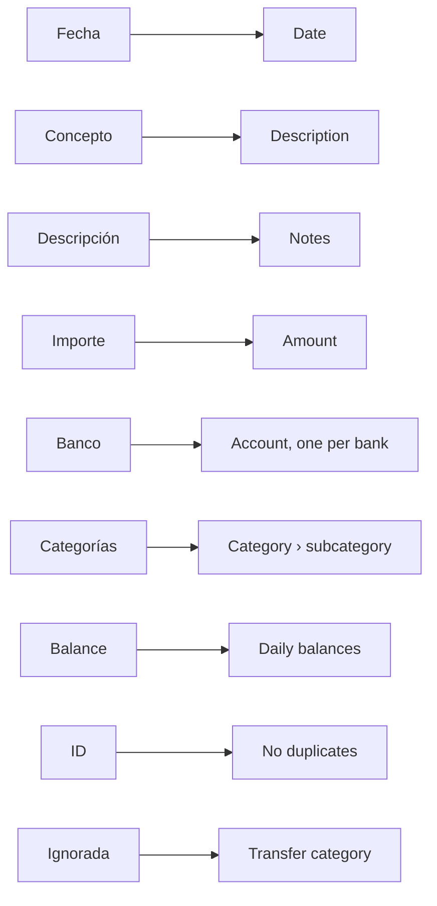

# Import from Banktrack

Banktrack exports all your transactions in one file, and Whisper Money knows its layout: the columns, the accounts and the categories are filled in for you, so moving over is mostly a matter of checking.

{{TOC}}

## Quick start

1. In Banktrack, download your transactions as CSV or Excel, with no filters on.
2. In Whisper Money, open **Settings → Import from another app** and **Start import**.
3. Choose **Banktrack** and upload the file as it is.
4. Check the accounts and the categories.
5. Import.

The full import is open while you set up your account and for 15 days after.
See [Import from another app](/documentation/import-from-another-app) for how
every step works.

## Export your data from Banktrack

According to [Banktrack's help center](https://docs.banktrack.com/es/articles/14708658-transacciones),
the **Descargar** button in its **Transacciones** module downloads the
transactions you see, as PDF, CSV, XLSX or JSON. Choose CSV or XLSX.

The download follows the filters you have on, so before you click it:

- Leave the bank and account filter empty, so every account is in the file.
- Pick the widest period, so every year is in it too.

Then upload the file as it comes. There is no need to open it, rename columns
or delete rows.

## How the columns are read

| Banktrack column  | In Whisper Money                                                                                               |
| ----------------- | -------------------------------------------------------------------------------------------------------------- |
| Fecha             | The date, read as day/month/year.                                                                              |
| Concepto          | The description.                                                                                               |
| Descripción       | The notes, when it says something the concept does not. When the concept is empty, it becomes the description. |
| Importe           | The amount, with its decimal comma and its sign.                                                               |
| Banco             | The account: one per different value.                                                                          |
| Producto - Nombre | Only if you turn on the split described below.                                                                 |
| Categorías        | The category, split at the comma into a category and its subcategory.                                          |
| Moneda            | The currency.                                                                                                  |
| Balance           | The daily balances, for the accounts that have any.                                                            |
| Producto - IBAN   | The IBAN of the account, unless it is masked.                                                                  |
| ID                | Banktrack's own ID, so importing the file again duplicates nothing.                                            |
| Ignorada          | Rows marked TRUE go to a transfer category.                                                                    |

**Fecha de ejecución**, **Signo cambiado**, the **Contacto** columns,
**Archivos** and **Facturas** are not imported. If you would rather use the
execution date, choose **Fecha de ejecución** in the Date field.

## One account per bank

**Banco** holds the name you gave each account in Banktrack, so each different
value becomes one account: "BBVA Conjunta", "Wise Personal", "Cash".

**Producto - Nombre** could tell apart two accounts at the same bank, but
Banktrack does not always fill it in, so the same account can come with and
without it. That is why splitting by it is off. Turn on **Also split by
«Producto - Nombre»** only if you have several accounts at one bank.

Each account gets a bank from our list when its name matches one. When it does
not, Whisper Money creates a bank of your own with that name, which you can
change. Cash accounts get no bank. Accounts named like one of your manual
accounts go into it unless you choose otherwise, and an account you have
connected is never touched: its Banktrack history goes into a separate manual
account.

## Categories, own transfers and ignored rows

- **Categorías** with a comma become a category and its subcategory:
  "Empresa, Gastos Empresa" is Empresa › Gastos Empresa. Names you already have
  are merged with yours.
- **Traspasos Propios**, Banktrack's transfers between your own accounts, go to
  your **Own account** transfer category.
- Rows with **Ignorada** set to TRUE were left out of Banktrack's totals. Here
  they go to a transfer category, **Other transfers** unless you choose another,
  so they count as neither spending nor income.

## Importing a newer export

Banktrack gives every transaction its own ID, and Whisper Money keeps it. If you
keep using Banktrack for a few more days and export again, importing the new file
brings in only the transactions that were not there yet, as long as the full
import is still open to you.

## FAQ

### Which date is used, Fecha or Fecha de ejecución?

**Fecha**, the date of the transaction. Choose **Fecha de ejecución** in the
Date field if you prefer the date it was carried out.

### I flipped the sign of some transactions in Banktrack. Is that kept?

The **Signo cambiado** column is not read: each amount comes in exactly as the
**Importe** column has it. Check the preview in the columns step before you
continue.

### Are my contacts and invoices imported?

No. The **Contacto**, **Archivos** and **Facturas** columns stay in Banktrack.

### The file has blank rows in the middle. Is that a problem?

No. Blank rows are skipped, and the preview tells you how many.
