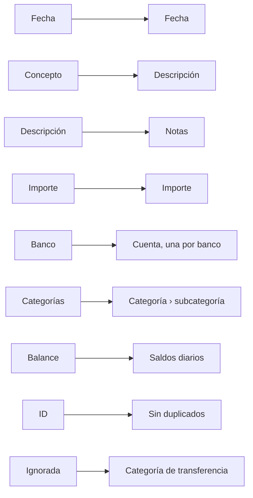

# Importar desde Banktrack

Banktrack exporta todas tus transacciones en un solo archivo, y Whisper Money conoce su formato: las columnas, las cuentas y las categorías se rellenan solas, así que mudarte es sobre todo cuestión de revisar.

{{TOC}}

## Inicio rápido

1. En Banktrack, descarga tus transacciones en CSV o Excel, sin ningún filtro puesto.
2. En Whisper Money, abre **Configuración → Importar desde otra app** y pulsa **Empezar importación**.
3. Elige **Banktrack** y sube el archivo tal cual.
4. Revisa las cuentas y las categorías.
5. Importa.

La importación completa está abierta mientras configuras tu cuenta y durante los
15 días siguientes. En [Importar desde otra app](/documentation/import-from-another-app)
se explica cada paso.

## Exporta tus datos de Banktrack

Según el [centro de ayuda de Banktrack](https://docs.banktrack.com/es/articles/14708658-transacciones),
el botón **Descargar** del módulo **Transacciones** descarga las transacciones que
ves en pantalla, en PDF, CSV, XLSX o JSON. Elige CSV o XLSX.

La descarga respeta los filtros que tengas puestos, así que antes de pulsarlo:

- Deja vacío el filtro de banco y cuenta, para que estén todas las cuentas.
- Elige el periodo más amplio, para que estén también todos los años.

Después sube el archivo tal y como sale. No hace falta abrirlo, ni renombrar
columnas, ni borrar filas.

## Cómo se leen las columnas

| Columna de Banktrack | En Whisper Money                                                                                           |
| -------------------- | ---------------------------------------------------------------------------------------------------------- |
| Fecha                | La fecha, leída como día/mes/año.                                                                          |
| Concepto             | La descripción.                                                                                            |
| Descripción          | Las notas, cuando dice algo que el concepto no dice. Si el concepto está vacío, pasa a ser la descripción. |
| Importe              | El importe, con su coma decimal y su signo.                                                                |
| Banco                | La cuenta: una por cada valor distinto.                                                                    |
| Producto - Nombre    | Solo si activas la separación que se explica más abajo.                                                    |
| Categorías           | La categoría, partida por la coma en categoría y subcategoría.                                             |
| Moneda               | La moneda.                                                                                                 |
| Balance              | Los saldos diarios, de las cuentas que tengan alguno.                                                      |
| Producto - IBAN      | El IBAN de la cuenta, salvo que venga enmascarado.                                                         |
| ID                   | El identificador propio de Banktrack, para que volver a importar el archivo no duplique nada.              |
| Ignorada             | Las filas marcadas con TRUE van a una categoría de transferencia.                                          |

**Fecha de ejecución**, **Signo cambiado**, las columnas de **Contacto**,
**Archivos** y **Facturas** no se importan. Si prefieres la fecha de ejecución,
elige **Fecha de ejecución** en el campo Fecha.

## Una cuenta por banco

**Banco** guarda el nombre que le diste a cada cuenta en Banktrack, así que cada
valor distinto pasa a ser una cuenta: «BBVA Conjunta», «Wise Personal», «Cash».

**Producto - Nombre** podría distinguir dos cuentas del mismo banco, pero
Banktrack no siempre lo rellena, así que la misma cuenta puede venir con él y sin
él. Por eso la separación está desactivada. Activa **Separar también por
«Producto - Nombre»** solo si tienes varias cuentas en un mismo banco.

Cada cuenta recibe un banco de nuestra lista cuando su nombre coincide con uno. Si
no coincide, Whisper Money crea un banco propio con ese nombre, que puedes
cambiar. Las cuentas de efectivo no llevan banco. Una cuenta que se llame igual
que una de tus cuentas manuales va a ella salvo que elijas otra cosa, y una cuenta
que tengas conectada no se toca nunca: su histórico de Banktrack va a una cuenta
manual aparte.

## Categorías, traspasos propios y filas ignoradas

- Las **Categorías** con una coma pasan a ser una categoría y su subcategoría:
  «Empresa, Gastos Empresa» es Empresa › Gastos Empresa. Las que ya tienes se
  unen con las tuyas.
- Los **Traspasos Propios**, las transferencias de Banktrack entre tus propias
  cuentas, van a tu categoría de transferencia **Cuenta propia**.
- Las filas con **Ignorada** a TRUE se quedaban fuera de los totales de
  Banktrack. Aquí van a una categoría de transferencia, **Otras transferencias**
  salvo que elijas otra, así que no cuentan ni como gasto ni como ingreso.

## Importar una exportación más reciente

Banktrack da a cada transacción su propio identificador, y Whisper Money lo
guarda. Si sigues usando Banktrack unos días más y vuelves a exportar, al importar
el archivo nuevo solo entran las transacciones que todavía no estaban, siempre que
sigas teniendo abierta la importación completa.

## Preguntas frecuentes

### ¿Qué fecha se usa, Fecha o Fecha de ejecución?

**Fecha**, la fecha de la transacción. Elige **Fecha de ejecución** en el campo
Fecha si prefieres la fecha en que se ejecutó.

### Cambié el signo de algunas transacciones en Banktrack. ¿Se conserva?

La columna **Signo cambiado** no se lee: cada importe entra tal y como lo trae la
columna **Importe**. Revisa la vista previa del paso de columnas antes de seguir.

### ¿Se importan mis contactos y mis facturas?

No. Las columnas de **Contacto**, **Archivos** y **Facturas** se quedan en
Banktrack.

### El archivo tiene filas en blanco por medio. ¿Es un problema?

No. Las filas en blanco se saltan, y la vista previa te dice cuántas había.
