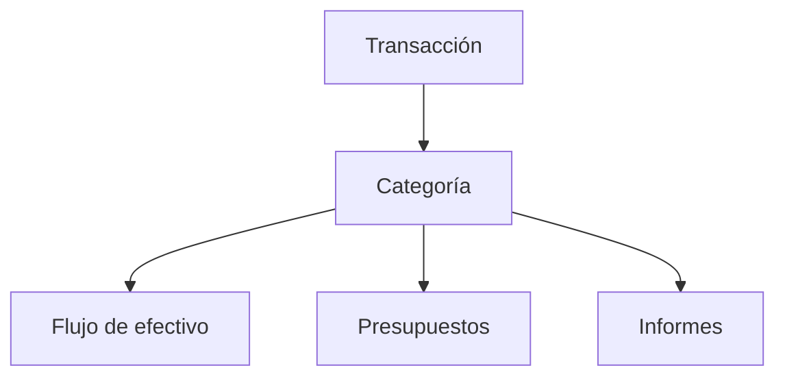

# Categorías

Las categorías explican qué significa cada transacción. Elige bien la categoría y tus informes serán más fáciles de confiar.

{{TOC}}

## Inicio rápido

1. Decide si la transacción es ingreso, gasto, transferencia, ahorro o inversión.
2. Usa categorías de transferencia para dinero que se mueve entre tus propias cuentas.
3. Revisa las transacciones sin categoría a menudo.
4. Crea reglas de automatización para comercios repetidos.

> ¿No sabes qué elegir? Empieza por el tipo. Puedes cambiar el nombre de la categoría después.

## Mapa de categorías

Ejemplos:

- Supermercado → Gasto → informes de gasto y presupuestos.
- Salario → Ingreso → informes de ingresos y flujo de efectivo.
- Cuenta corriente a ahorro → Transferencia → evita contar dos veces.

## Tipos de categoría

Cada categoría tiene un tipo.

### Gasto

Usa este tipo para dinero que sale de tus finanzas.

Ejemplos:

- Supermercado
- Alquiler
- Transporte
- Suscripciones
- Impuestos

### Ingreso

Usa este tipo para dinero que entra en tus finanzas.

Ejemplos:

- Salario
- Ingresos freelance
- Reembolsos
- Dividendos
- Intereses

### Transferencia

Usa este tipo cuando el dinero se mueve entre cuentas que son tuyas.

Ejemplos:

- Cuenta corriente a ahorro
- Cuenta bancaria a tarjeta de crédito
- Cuenta bancaria a inversión

### Ahorro

Usa este tipo cuando el dinero sale de tus finanzas del día a día para guardarlo.

Ejemplos:

- Traspaso mensual al fondo de emergencia
- Dinero apartado para un objetivo

Las categorías de ahorro no son gasto. Alimentan la tarjeta «Ahorrado e
invertido» de la página de Flujo de efectivo.

### Inversión

Usa este tipo cuando el dinero sale de tus finanzas del día a día para
invertirlo.

Ejemplos:

- Aportación al bróker
- Aportación a un plan de pensiones
- Compra de un fondo indexado

Igual que el ahorro, las inversiones cuentan como dinero apartado y no como
gasto.

## Transferencias y dirección de flujo de efectivo

Las categorías de transferencia pueden mostrarse u ocultarse en flujo de efectivo.

Opciones:

- **No mostrar**: oculta la transferencia del flujo de efectivo.
- **Mostrar como entrada de efectivo**: muestra la transferencia como dinero que entra.
- **Mostrar como salida de efectivo**: muestra la transferencia como dinero que sale.

Para la mayoría de movimientos entre tus propias cuentas, **No mostrar** es la opción más segura.

La dirección solo la eliges tú en las categorías de transferencia. Las de ahorro
e inversión cuentan siempre como dinero que sale, y las de ingreso y gasto se
cuentan por su tipo y no por una dirección.

## Transacciones sin categoría

Las transacciones importadas o sincronizadas pueden empezar sin categoría.

Prueba esta rutina:

1. Abre las transacciones sin categoría.
2. Asigna primero las más obvias.
3. Deja las confusas para más tarde si hace falta.
4. Crea reglas de automatización para comercios o descripciones repetidas.

## Quién asignó la categoría

Cada transacción categorizada registra cómo obtuvo su categoría:

- **Tú**, al elegirla.
- **Una regla de automatización** que coincidió con ella.
- **Whisper Money**, si has activado la categorización con IA.
- **Tu banco**, si la conexión la proporcionó.

Los filtros de transacciones pueden acotar la lista por cualquiera de estas
opciones, que es la forma más rápida de revisar lo que se asignó automáticamente
antes de fiarte de los informes del mes.

## Categorización con IA

Whisper Money puede sugerir categorías para las transacciones que aún no has
categorizado. Está desactivada hasta que tú la actives, porque implica enviar la
descripción de la transacción a un proveedor de IA.

Lo que conviene saber:

- Tú decides si la activas, y puedes desactivarla en cualquier momento.
- Solo rellena categorías vacías. Nunca sobrescribe una que hayas elegido.
- Lo que asigna queda marcado como puesto por Whisper Money, así que puedes
  encontrarlo y revisarlo después.
- Corregir una de sus categorías se puede convertir en una regla de
  automatización, para que el mismo comercio se resuelva sin IA la próxima vez.

## Cambiar una categoría

Cambiar la categoría de una transacción actualiza los informes que incluyen esa transacción.

Esto puede afectar:

- Totales de gasto
- Progreso de presupuestos
- Totales de ingresos
- Flujo de efectivo

Cambiar la categoría en sí, como su nombre o tipo, afecta a todas las transacciones que usan esa categoría.

## Preguntas frecuentes

### ¿Qué pasa si elijo la categoría equivocada?

Puedes cambiarla después. Los informes se actualizan cuando la transacción se recategoriza.

### ¿Los pagos de tarjeta de crédito deberían ser gastos?

Normalmente no. Si ya registras las compras de la tarjeta, el pago es dinero moviéndose entre tus propias cuentas. Usa una categoría de transferencia.

### ¿Cuántas categorías debería crear?

Empieza con pocas. Demasiadas categorías hacen que los informes sean más difíciles de leer. Añade más solo cuando necesites más detalle.

## Buenos hábitos con categorías

- Usa nombres cortos y claros.
- Evita categorías duplicadas para el mismo tipo de gasto.
- Usa categorías de transferencia para movimientos entre tus propias cuentas.
- Revisa las transacciones sin categoría antes de confiar en los informes mensuales.
- Automatiza comercios y descripciones repetidas.
