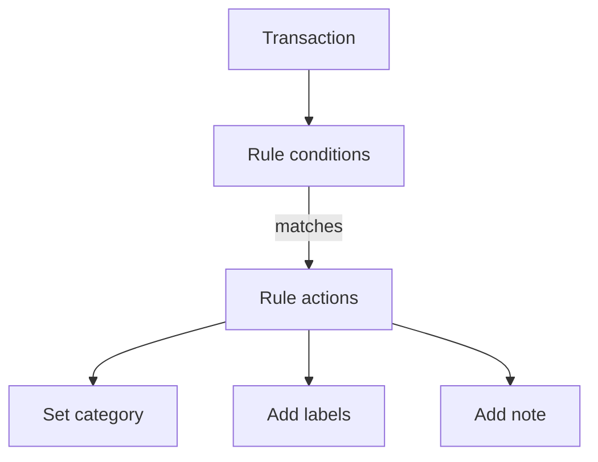

# Automation rules

Automation rules save time by updating matching transactions for you. They can set a category, add labels, and add a note.

{{TOC}}

## Quick start

1. Open Automation rules from settings or from the transaction tools.
2. Create a rule with one or more conditions.
3. Choose at least one action: category or labels.
4. Save the rule.
5. Apply it to existing transactions if you want old matches updated too.

## How rules work

Rules are checked by priority. The first matching rule can apply its actions.

## Conditions

Conditions decide whether a rule matches a transaction.

### Description

Match text from the bank description.

Good for merchants, subscriptions, and repeated payments.

### Amount

Match an exact amount or compare amounts.

Good for fixed subscriptions or recurring transfers.

### Bank name

Match transactions from a specific bank.

Good when the same merchant appears differently by bank.

### Account name

Match a specific account.

Good when one account needs special handling.

### Creditor name

Match who was paid, when the bank supplies it separately from the description.

This field can also be matched on being empty or not empty.

### Debtor name

Match who paid, when the bank supplies it separately from the description.

Good for incoming transfers from the same person or company.

Each condition compares a field with a value. Text fields can _contain_ or
_equal_ a value, amounts can _equal_, be _greater than_ or _less than_ one, and
creditor and debtor name can also be _empty_ or _not empty_.

## Actions

Actions are what the rule changes.

A rule can:

- Set a category.
- Add one or more labels.
- Add a note.

At least one category or label action is required.

## Groups and priority

Use groups when a rule needs more than one condition.

Examples:

- Description contains "Netflix" **and** amount is less than 20.
- Description contains "Uber" **or** description contains "Cabify".

Priority controls which rule wins when multiple rules could match.

Put specific rules before broad rules.

## Applying rules to existing transactions

Rules run as new transactions arrive. Transactions that already existed need a manual apply step.

Use apply or re-evaluate when:

- You create a new rule.
- You change a rule.
- You imported old transactions.
- You want to clean a backlog.

## Suggested rules

Instead of writing every rule yourself, Whisper Money can read the merchants that
repeat in your transactions and suggest rules for them. You review each
suggestion and decide whether to keep it, and nothing is created until you
accept it.

Suggestions come from two places:

- **Your history**, when there is enough of it to spot a pattern.
- **Your corrections**, when you change a category that was set automatically.
  The next transaction from that merchant is then handled by a rule.

Suggested rules are part of the paid plan. Rules you write yourself are not.

## What rules do not do

Rules run on transactions, not on your accounts or budgets. A rule can only set
a category, add labels, and add a note.

Two things worth knowing:

- A rule never runs twice over the same transaction on its own. Changing a rule
  does not re-run it over your history until you apply it.
- Only the first matching rule applies. A transaction is never touched by two
  rules in the same pass.

## FAQ

### Why did a rule not run?

Check the description, amount, account, and priority. If another rule with a
higher priority also matched, that one applied instead. And if the transaction
already existed when you wrote the rule, it needs the apply step.

### Should I create broad or specific rules?

Start specific. Broad rules are useful, but they can match too much.

### Can a rule add multiple labels?

Yes. A rule can add more than one label.
