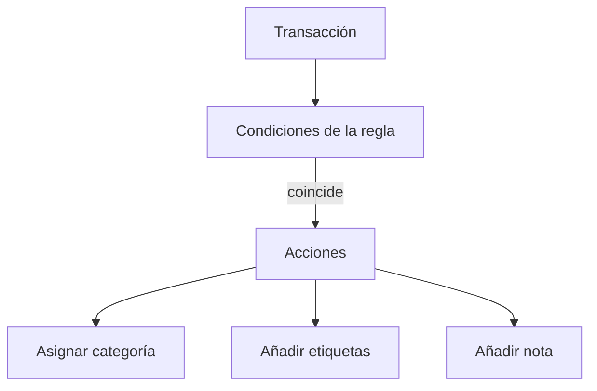

# Reglas de automatización

Las reglas de automatización ahorran tiempo actualizando transacciones coincidentes por ti. Pueden asignar una categoría, añadir etiquetas y añadir una nota.

{{TOC}}

## Inicio rápido

1. Abre Reglas de automatización desde ajustes o desde herramientas de transacciones.
2. Crea una regla con una o más condiciones.
3. Elige al menos una acción: categoría o etiquetas.
4. Guarda la regla.
5. Aplícala a transacciones existentes si quieres actualizar coincidencias antiguas.

## Cómo funcionan las reglas

Las reglas se revisan por prioridad. La primera regla que coincide puede aplicar sus acciones.

## Condiciones

Las condiciones deciden si una regla coincide con una transacción.

### Descripción

Coincide con texto de la descripción bancaria.

Útil para comercios, suscripciones y pagos repetidos.

### Importe

Coincide con un importe exacto o compara importes.

Útil para suscripciones fijas o transferencias recurrentes.

### Nombre del banco

Coincide con transacciones de un banco específico.

Útil cuando el mismo comercio aparece distinto según el banco.

### Nombre de la cuenta

Coincide con una cuenta específica.

Útil cuando una cuenta necesita tratamiento especial.

### Nombre del acreedor

Coincide con quién recibió el pago, cuando el banco lo envía aparte de la
descripción.

Este campo también admite comprobar si está vacío o no.

### Nombre del deudor

Coincide con quién pagó, cuando el banco lo envía aparte de la descripción.

Útil para transferencias entrantes de la misma persona o empresa.

Cada condición compara un campo con un valor. Los campos de texto pueden
_contener_ o ser _igual a_ un valor, los importes pueden ser _igual a_, _mayor
que_ o _menor que_ uno, y el nombre del acreedor y del deudor admiten además
_está vacío_ y _no está vacío_.

## Acciones

Las acciones son lo que cambia la regla.

Una regla puede:

- Asignar una categoría.
- Añadir una o más etiquetas.
- Añadir una nota.

Hace falta al menos una acción de categoría o etiqueta.

## Grupos y prioridad

Usa grupos cuando una regla necesita más de una condición.

Ejemplos:

- La descripción contiene "Netflix" **y** el importe es menor que 20.
- La descripción contiene "Uber" **o** la descripción contiene "Cabify".

La prioridad controla qué regla gana cuando varias podrían coincidir.

Pon reglas específicas antes que reglas amplias.

## Aplicar reglas a transacciones existentes

Las reglas se ejecutan a medida que llegan transacciones nuevas. Las que ya existían necesitan un paso manual de aplicación.

Usa aplicar o reevaluar cuando:

- Creas una regla nueva.
- Cambias una regla.
- Importaste transacciones antiguas.
- Quieres limpiar una acumulación de transacciones.

## Reglas sugeridas

En lugar de escribir todas las reglas a mano, Whisper Money puede leer los
comercios que se repiten en tus transacciones y sugerir reglas para ellos. Tú
revisas cada sugerencia y decides si la quieres, y no se crea nada hasta que la
aceptas.

Las sugerencias vienen de dos sitios:

- **Tu historial**, cuando hay suficiente para detectar un patrón.
- **Tus correcciones**, cuando cambias una categoría que se asignó
  automáticamente. La siguiente transacción de ese comercio la resuelve ya una
  regla.

Las reglas sugeridas forman parte del plan de pago. Las que escribes tú, no.

## Lo que las reglas no hacen

Las reglas actúan sobre transacciones, no sobre tus cuentas ni tus presupuestos.
Una regla solo puede asignar una categoría, añadir etiquetas y añadir una nota.

Dos cosas que conviene saber:

- Una regla nunca se ejecuta dos veces sobre la misma transacción por su cuenta.
  Cambiar una regla no la vuelve a pasar por tu historial hasta que la aplicas.
- Solo se aplica la primera regla que coincide. Una transacción nunca la tocan
  dos reglas en la misma pasada.

## Preguntas frecuentes

### ¿Por qué no se ejecutó una regla?

Revisa la descripción, el importe, la cuenta y la prioridad. Si otra regla con
más prioridad también coincidía, se aplicó esa. Y si la transacción ya existía
cuando escribiste la regla, necesita el paso de aplicar.

### ¿Debería crear reglas amplias o específicas?

Empieza con reglas específicas. Las reglas amplias son útiles, pero pueden coincidir con demasiado.

### ¿Una regla puede añadir varias etiquetas?

Sí. Una regla puede añadir más de una etiqueta.
