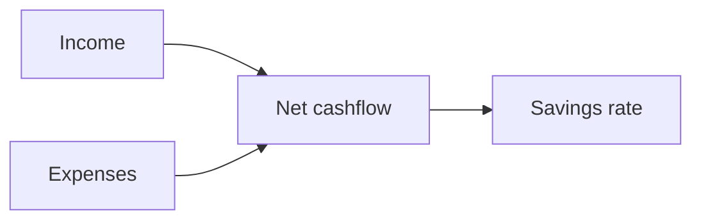

# Cashflow

Cashflow shows how money moves in and out during a period. It helps you understand whether you earned more than you spent.

{{TOC}}

## Quick start

1. Choose the month you want to review.
2. Check income and expense totals.
3. Look at net cashflow.
4. Review the money flow diagram.
5. Open income or expense breakdowns when something looks unusual.

## Cashflow formula



The basic formula is:

```text
Net cashflow = Income - Expenses
```

## Main cards

<div class="cards-wrapper">

<div class="card">
### Net cashflow

Shows what is left after expenses, next to the income and expense totals it came
from, and against the previous period.

Positive is usually good. Negative means expenses were higher than income. The
savings rate — the share of income left over — is shown here too.

</div>

<div class="card">
### Saved & Invested

Shows how much of the period's net cashflow you set aside, split between saved
and invested.

It is built from your savings and investment categories, so it only fills in
once transactions are using them.

</div>

<div class="card">
### Trend chart

Shows income, expenses, and net cashflow over recent months.

Use it to spot patterns.

</div>

<div class="card">
### Money flow

Shows where money came from and where it went, as one diagram from income
through to each category.

Use it to understand the biggest flows quickly.

</div>

<div class="card">
### Income and expense breakdowns

Two lists: where your money came from, and where it went.

Uncategorized transactions appear here as their own row, which is usually the
first thing to fix when a total looks wrong.

</div>
</div>

## Period navigation

The Cashflow page works by month.

Use period controls to move between months. The URL keeps the selected month, so you can refresh or share the same view.

## Income and expense breakdowns

Breakdowns show which categories make up income or spending.

Use them to answer questions like:

- Which category caused spending to increase?
- Was this month unusual?
- Which income source changed?
- Are uncategorized transactions affecting the result?

## Transfers in cashflow

Transfers are special.

Most transfers between your own accounts should not count as income or spending. If a transfer should appear in cashflow, set its cashflow direction on the category.

Options:

- Do not show.
- Show as cash inflow.
- Show as cash outflow.

## Money you set aside

Savings and investment categories are counted as money going out of your
day-to-day finances, the same as an expense, but they are kept separate from
spending: they are what fills the Saved & Invested card.

Use them for a transfer to an emergency fund or a deposit at a broker, and use a
plain transfer category for movement that is not either of those.

## When cashflow looks wrong

Check these first:

1. Are transactions categorized correctly?
2. Are transfers using the right cashflow direction?
3. Are dates in the expected month?
4. Are imported amounts positive and negative the right way around?
5. Are there uncategorized transactions?

## FAQ

### Why is savings rate negative?

Expenses were higher than income for the selected period.

### Why are transfers missing?

Transfer categories are usually hidden from cashflow. Change cashflow direction if you want them shown.

### Why does the current month look incomplete?

The month may not be finished yet. Income or bills may still be missing.
