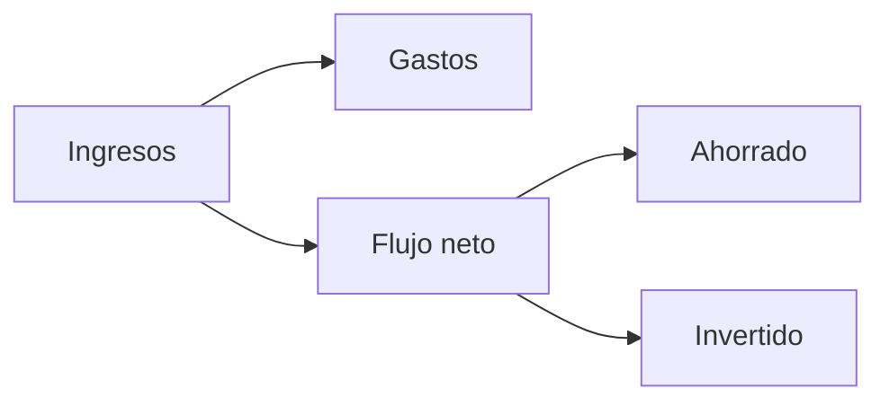

# Flujo de efectivo

Flujo de efectivo muestra cómo entra y sale el dinero durante un periodo. Te ayuda a entender si ganaste más de lo que gastaste.

{{TOC}}

## Inicio rápido

1. Elige el mes que quieres revisar.
2. Comprueba totales de ingresos y gastos.
3. Mira el flujo neto.
4. Revisa el diagrama de movimiento de dinero.
5. Abre desgloses de ingresos o gastos si algo parece extraño.

## Fórmula de flujo de efectivo



La fórmula básica es:

```text
Flujo neto = Ingresos - Gastos
```

## Tarjetas principales

<div class="cards-wrapper">

<div class="card">
### Flujo neto

Muestra lo que queda después de gastos, junto a los totales de ingresos y gastos
de los que sale, y comparado con el periodo anterior.

Positivo suele ser bueno. Negativo significa que los gastos fueron mayores que
los ingresos. La tasa de ahorro — la parte de los ingresos que sobra — también
se muestra aquí.

</div>

<div class="card">
### Ahorrado e invertido

Muestra qué parte del flujo neto del periodo has apartado, separando lo ahorrado
de lo invertido.

Se construye con tus categorías de ahorro e inversión, así que solo se rellena
cuando las transacciones empiezan a usarlas.

</div>

<div class="card">
### Gráfico de tendencia

Muestra ingresos, gastos y flujo neto en los últimos meses.

Úsalo para detectar patrones.

</div>

<div class="card">
### Movimiento de dinero

Muestra de dónde vino el dinero y a dónde fue, en un único diagrama que va de los
ingresos hasta cada categoría.

Úsalo para entender los flujos principales rápidamente.

</div>

<div class="card">
### Desgloses de ingresos y gastos

Dos listas: de dónde vino tu dinero y a dónde fue.

Las transacciones sin categoría aparecen aquí como una fila propia, que suele ser
lo primero que hay que arreglar cuando un total parece raro.

</div>
</div>

## Navegación por periodo

La página de Flujo de efectivo funciona por mes.

Usa los controles de periodo para moverte entre meses. La URL mantiene el mes seleccionado, así puedes refrescar o compartir la misma vista.

## Desgloses de ingresos y gastos

Los desgloses muestran qué categorías componen ingresos o gastos.

Úsalos para responder preguntas como:

- ¿Qué categoría hizo subir el gasto?
- ¿Este mes fue inusual?
- ¿Qué fuente de ingresos cambió?
- ¿Las transacciones sin categoría afectan el resultado?

## Transferencias en flujo de efectivo

Las transferencias son especiales.

La mayoría de transferencias entre tus propias cuentas no deberían contar como ingreso ni gasto. Si una transferencia debe aparecer en flujo de efectivo, ajusta su dirección en la categoría.

Opciones:

- No mostrar.
- Mostrar como entrada de efectivo.
- Mostrar como salida de efectivo.

## El dinero que apartas

Las categorías de ahorro e inversión cuentan como dinero que sale de tus finanzas
del día a día, igual que un gasto, pero se mantienen separadas del gasto: son lo
que rellena la tarjeta «Ahorrado e invertido».

Úsalas para un traspaso al fondo de emergencia o una aportación al bróker, y usa
una categoría de transferencia normal para el movimiento que no sea ninguna de
las dos cosas.

## Cuando el flujo de efectivo parece incorrecto

Revisa esto primero:

1. ¿Las transacciones están bien categorizadas?
2. ¿Las transferencias usan la dirección correcta?
3. ¿Las fechas están en el mes esperado?
4. ¿Los importes importados tienen el signo correcto?
5. ¿Hay transacciones sin categoría?

## Preguntas frecuentes

### ¿Por qué la tasa de ahorro es negativa?

Los gastos fueron mayores que los ingresos en el periodo seleccionado.

### ¿Por qué faltan transferencias?

Las categorías de transferencia suelen estar ocultas del flujo de efectivo. Cambia la dirección si quieres mostrarlas.

### ¿Por qué el mes actual parece incompleto?

Puede que el mes aún no haya terminado. Pueden faltar ingresos o facturas.
