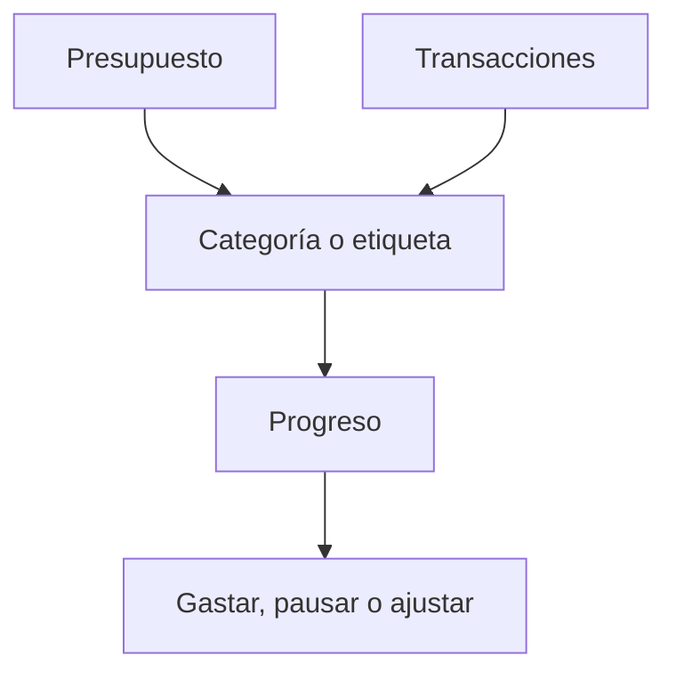

# Presupuestos

Los presupuestos te ayudan a planificar gastos y ver cuánto margen queda en un periodo.

{{TOC}}

## Inicio rápido

1. Crea un presupuesto para un área que quieres controlar.
2. Elige la categoría o etiqueta que debe seguir.
3. Define el importe del periodo.
4. Revisa el progreso durante el mes.
5. Ajusta el presupuesto cuando tu gasto real cambie.

## Flujo de un presupuesto

## Qué sigue un presupuesto

Un presupuesto puede seguir gastos que coinciden con una categoría o etiqueta.

Usa una categoría cuando el gasto tiene un significado claro.

Usa una etiqueta cuando el gasto cruza varias categorías.

Ejemplo:

- Presupuesto por categoría: Supermercado.
- Presupuesto por etiqueta: Vacaciones, Proyecto, Viaje de trabajo.

## Buenos ejemplos de presupuesto

### Supermercado

Útil para gasto diario que ocurre a menudo.

Revisar semanalmente.

### Restaurantes

Útil para gasto opcional que puede crecer rápido.

Revisar a mitad de mes.

### Viajes

Útil para gastos que cruzan varias categorías.

Un presupuesto basado en etiqueta puede funcionar bien aquí.

### Suscripciones

Útil para gastos repetidos.

Las reglas de automatización pueden ayudar a mantenerlos categorizados.

## Leer el progreso del presupuesto

El progreso compara transacciones coincidentes con el importe del presupuesto.

Si el progreso es alto al principio del periodo, reduce el gasto o sube el presupuesto si el plan era demasiado bajo.

Si el progreso es bajo, puede que el presupuesto sea generoso o que el periodo no haya terminado.

## Periodos de presupuesto

Un presupuesto se repite en el periodo que elijas: **mensual**, **semanal**,
**cada dos semanas** o **anual**. El mensual encaja con la mayoría del gasto; el
semanal va bien para la compra; el anual sirve para cosas como seguros o
impuestos que llegan una vez.

Al revisar un presupuesto, asegúrate de mirar el periodo correcto.

### Qué pasa al final de un periodo

Cada presupuesto decide qué hacer con lo que sobra:

- **Reiniciar**: el periodo siguiente empieza de nuevo con el importe del
  presupuesto. Es la opción habitual para el gasto corriente.
- **Arrastrar**: lo que no has gastado se suma al periodo siguiente, y pasarte se
  lo come. Mejor para un presupuesto en el que vas acumulando, como un
  presupuesto anual de viajes.

## Un presupuesto para todo lo demás

Un presupuesto se puede marcar como general. En lugar de seguir una categoría o
una etiqueta, absorbe todo el gasto que ningún otro presupuesto esté siguiendo ya.

Responde a la pregunta que un conjunto de presupuestos normalmente no puede:
cuánto estoy gastando fuera de lo que había planificado.

## Avisos

Un presupuesto puede avisarte cuando necesita atención:

- Cuando entra una transacción nueva.
- Cuando se acerca a su límite.
- Cuando se pasa.

Llegan por correo y se configuran por presupuesto en Ajustes → Notificaciones,
donde también puedes decidir con qué empiezan los presupuestos nuevos. Así puedes
vigilar los dos que importan y dejar el resto en silencio.

## Errores comunes

- Presupuestar antes de categorizar transacciones.
- Crear demasiados presupuestos de golpe.
- Mezclar compras puntuales con gasto mensual normal.
- Olvidar que las etiquetas pueden ser mejores para proyectos o viajes.

## Preguntas frecuentes

### ¿Los presupuestos cambian mis transacciones?

No. Los presupuestos leen transacciones. No las cambian.

### ¿Cada categoría debería tener un presupuesto?

No. Presupuesta solo lo que quieras controlar activamente.

### ¿Por qué un presupuesto aparece vacío?

Las transacciones coincidentes pueden estar sin categoría, usar otra etiqueta o estar en otro periodo.
