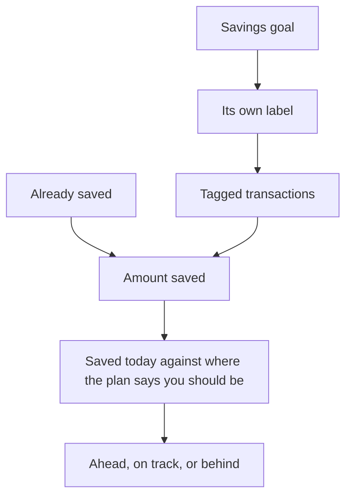

# Savings goals

A savings goal is an amount you are working towards, and a way of watching whether you will get there in time. A budget puts a ceiling on spending; a goal puts a floor under saving.

{{TOC}}

## Quick start

1. Open **Planning** and create a savings goal.
2. Name it, set the amount you are aiming for, and pick a date if you have one.
3. Tell it what you had already put aside, if anything.
4. Link the transactions that fund it.
5. Come back and see whether you are ahead or behind.

## How a goal counts

## A goal is a label

Creating a goal creates a [label](/documentation/labels) with the same name, and
the goal tracks whatever carries it. That is the whole mechanism, and it is why
goals need so little setting up: labelling is something you already do.

The label belongs to the goal, so it does not clutter your label settings and
cannot be renamed out from under the goal. Renaming the goal renames it. You
also cannot create a goal with the name of a label you already have — pick
another name, or use a budget if that label is already doing this job.

## Linking transactions

**Link transactions** shows everything already tagged, plus a window of your
recent transactions, and you tick the ones that funded the goal. What you leave
ticked when you save is the complete set — unticking one takes it back out.

The window starts at your fifty most recent transactions and widens as you ask
for more. If what you are looking for is further back than that, tag it from the
transaction list instead: the goal's label is there like any other, and bulk
actions can tag a whole group at once.

### Letting a rule do it

An [automation rule](/documentation/automation-rules) can also attach the label,
which is the least effort of all when the same standing order funds the goal
every month. One rule keyed on the savings account files everything that lands
in it, the history included, and every transfer from then on arrives already
counted.

## Which way a transaction counts

This is the one part worth reading slowly, because the sign depends on the
account the transaction is in.

**On a savings account, the money arriving is the saving.** A 500 deposit into
your savings account adds 500 to the goal. Taking 200 back out subtracts 200.

**On any other account, the money leaving is the saving.** A 500 transfer out of
your current account is what funded the goal, so it adds 500. Money coming back
the other way subtracts.

Both read the same way round in the end: put money aside and the goal goes up,
take it back and the goal goes down. You just do not have to think about which
side of the transfer you happened to tag.

What you should not do is tag _both_ sides. A transfer from current account to
savings is two transactions, and each of them counts as a contribution on its
own terms, so tagging the pair counts the same 500 twice. Tag the leg you think
of as the saving and leave the other one alone.

## What you had already saved

Most goals do not start from zero. The **already saved** amount is what was in
the pot on the day you created the goal, and it counts towards the total without
you having to hunt down years of old transfers.

It is deliberately left out of your saving _pace_: it was there on day one, so
counting it would read as an enormous daily rate and project you finished by
next week. Only what you have added since sets the pace. You can adjust the
figure later if you got it wrong.

## Reading the progress

The card at the top is where you stand. Underneath it, the chart draws what you
have actually saved against the straight line the plan would need, and continues
your current pace as a dotted line so you can see where it lands.

When the goal has a target date, it also tells you:

- **Where you should be today.** The point on that straight line, from what you
  had already saved to the target, for today's date.
- **Ahead, on track or behind.** How your real total compares with that point.
  There is a small tolerance either side, so a few coins do not flip the badge.
- **What you need per month.** What is left, spread over the days remaining.

Without a target date you still get the total, the percentage, and an estimated
completion date based on the pace you have kept so far.

Your pace is measured from the earlier of the day you created the goal and your
oldest linked transaction. That matters when you tag savings you had already
made: the elapsed time comes with them, so the goal does not report a pace you
never actually kept.

## Goals and budgets together

Goals sit next to [budgets](/documentation/budgets) under Planning, and the list
can be filtered to one or the other. They are complementary rather than
alternatives: a budget tells you how much room is left this month, a goal tells
you how far along you are overall.

A goal card fills up as you save. A budget card drains as you spend. That is how
you tell them apart at a glance in a mixed list.

## Finishing a goal

When a goal is done — or when you have given up on it — **archive** it. That
puts it away without deleting anything, and it is worth knowing exactly what it
does, because **archiving cannot be undone**:

- The amount saved is frozen at whatever it is that day, whatever happens to
  those transactions afterwards.
- The goal's label goes away. The transactions that carried it keep their
  history but stop showing it, and the label can never be picked again.
- Any automation rule that was attaching that label stops attaching it.
- You can no longer edit the goal or link more transactions to it. You can still
  open it and look at what you saved.

**Deleting** a goal is the other option: it removes the goal and its label
entirely, and nothing is kept. The transactions are untouched either way —
neither archiving nor deleting a goal changes a single amount, date or category.

## Good goals

### Emergency fund

A large target with no particular date.

Watch the pace rather than the deadline.

### Deposit for a flat

A target and a date you actually mean.

The needed-per-month figure is the useful one here.

### Next year's holiday

Funded by a standing order every month.

An automation rule can tag it for you.

### New laptop

Small, quick, and easy to see finish.

Archive it when it is bought.

## Common mistakes

- **Tagging both legs of a transfer.** The same money is counted twice. Tag one
  side.
- **Putting the money you already had into the linked transactions instead of
  the starting amount.** It works, but it distorts the pace and the projection.
- **Archiving to tidy up.** Archiving is one-way and takes the label with it. If
  you might come back to the goal, leave it alone.
- **Expecting a goal to move money.** It reads your transactions, exactly like a
  budget does. Nothing is transferred anywhere.

## FAQ

### Does a savings goal move money between my accounts?

No. Nothing in Whisper Money moves money. A goal reads the transactions you tag
and adds them up.

### Why is my goal at zero when I have linked transactions?

Check the account the transactions are in. On a savings account the deposits
count; anywhere else the payments _out_ count. If you have tagged deposits into
a current account, they are reading as money coming back out of the goal.

### Can two goals track the same transaction?

Yes. A transaction can carry as many labels as you like, so it can contribute to
more than one goal.

### Does the goal's label show up in my label settings?

No. It belongs to the goal and is managed from there, so it stays out of the
list in Settings → Labels.

### Can I reopen an archived goal?

No. Archiving is one-way. Create a new goal and link the transactions you want
it to count.

### What happens to my transactions if I delete a goal?

Nothing, beyond losing the goal's label. Amounts, dates, categories and every
other label are untouched.
