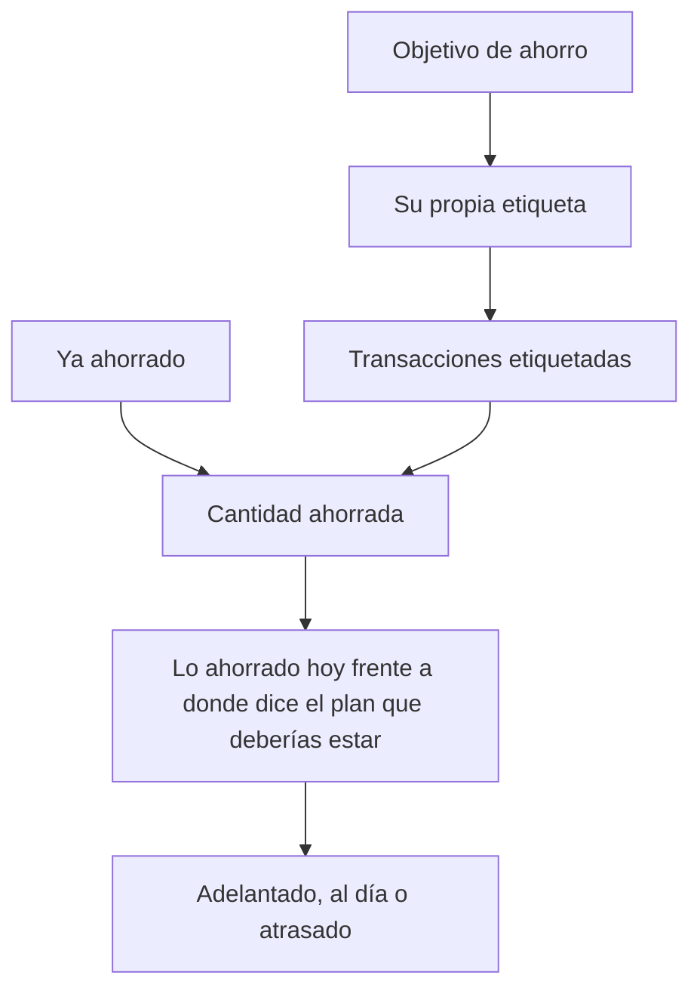

# Objetivos de ahorro

Un objetivo de ahorro es una cantidad a la que quieres llegar, y una forma de vigilar si llegarás a tiempo. Un presupuesto pone un techo al gasto; un objetivo pone un suelo al ahorro.

{{TOC}}

## Inicio rápido

1. Abre **Planificación** y crea un objetivo de ahorro.
2. Ponle nombre, define la cantidad a la que aspiras y elige una fecha si la tienes.
3. Indica lo que ya tenías apartado, si había algo.
4. Vincula las transacciones que lo alimentan.
5. Vuelve y comprueba si vas adelantado o atrasado.

## Cómo cuenta un objetivo

## Un objetivo es una etiqueta

Crear un objetivo crea una [etiqueta](/documentation/labels) con el mismo nombre,
y el objetivo sigue todo lo que la lleve. Ese es todo el mecanismo, y por eso los
objetivos necesitan tan poca preparación: etiquetar ya es algo que haces.

La etiqueta pertenece al objetivo, así que no te llena los ajustes de etiquetas
ni se puede renombrar a espaldas del objetivo. Renombrar el objetivo la renombra.
Tampoco puedes crear un objetivo con el nombre de una etiqueta que ya tienes:
elige otro nombre, o usa un presupuesto si esa etiqueta ya hace este trabajo.

## Vincular transacciones

**Vincular transacciones** muestra todo lo que ya está etiquetado, más una
ventana de tus transacciones recientes, y tú marcas las que alimentaron el
objetivo. Lo que quede marcado al guardar es el conjunto completo: desmarcar una
la saca.

La ventana empieza en tus cincuenta transacciones más recientes y se amplía a
medida que pides más. Si lo que buscas está más atrás, etiquétalo desde la lista
de transacciones: la etiqueta del objetivo está ahí como cualquier otra, y las
acciones masivas pueden etiquetar un grupo entero de una vez.

### Deja que lo haga una regla

Una [regla de automatización](/documentation/automation-rules) también puede
poner la etiqueta, que es lo que menos esfuerzo cuesta cuando la misma
transferencia periódica alimenta el objetivo todos los meses. Una regla sobre la
cuenta de ahorro archiva todo lo que entra en ella, el histórico incluido, y
cada traspaso a partir de entonces llega ya contado.

## En qué sentido cuenta una transacción

Esta es la parte que conviene leer despacio, porque el signo depende de la cuenta
en la que está la transacción.

**En una cuenta de ahorro, el dinero que entra es el ahorro.** Un ingreso de 500
en tu cuenta de ahorro suma 500 al objetivo. Sacar 200 resta 200.

**En cualquier otra cuenta, el dinero que sale es el ahorro.** Una transferencia
de 500 que sale de tu cuenta corriente es la que alimentó el objetivo, así que
suma 500. El dinero que vuelve en sentido contrario resta.

Al final las dos se leen igual: apartas dinero y el objetivo sube, lo recuperas y
el objetivo baja. Simplemente no tienes que pensar en qué lado de la
transferencia etiquetaste.

Lo que no debes hacer es etiquetar _los dos_ lados. Una transferencia de la
cuenta corriente al ahorro son dos transacciones, y cada una cuenta como
aportación por su cuenta, así que etiquetar el par cuenta dos veces los mismos 500. Etiqueta el lado que tú consideras el ahorro y deja el otro en paz.

## Lo que ya tenías ahorrado

La mayoría de los objetivos no empiezan de cero. La cantidad **ya ahorrado** es
lo que había en el bote el día que creaste el objetivo, y cuenta para el total
sin que tengas que rastrear años de transferencias antiguas.

Se deja fuera del _ritmo_ de ahorro a propósito: ya estaba ahí el primer día, así
que contarlo se leería como un ritmo diario enorme y te proyectaría terminado la
semana que viene. Solo lo que has añadido desde entonces marca el ritmo. Puedes
ajustar la cifra más tarde si te equivocaste.

## Leer el progreso

La tarjeta de arriba es dónde estás. Debajo, el gráfico dibuja lo que llevas
ahorrado de verdad frente a la línea recta que necesitaría el plan, y continúa tu
ritmo actual con una línea punteada para que veas dónde acaba.

Cuando el objetivo tiene fecha, además te dice:

- **Dónde deberías estar hoy.** El punto de esa línea recta, desde lo que ya
  tenías ahorrado hasta el objetivo, para la fecha de hoy.
- **Adelantado, al día o atrasado.** Cómo se compara tu total real con ese punto.
  Hay un pequeño margen a cada lado, para que unas monedas no cambien la
  etiqueta.
- **Cuánto necesitas al mes.** Lo que falta, repartido entre los días que quedan.

Sin fecha objetivo sigues teniendo el total, el porcentaje y una fecha estimada
según el ritmo que has llevado hasta ahora.

Tu ritmo se mide desde la más antigua de estas dos fechas: el día que creaste el
objetivo o tu transacción vinculada más antigua. Eso importa cuando etiquetas
ahorros que ya habías hecho: el tiempo transcurrido viene con ellos, así que el
objetivo no informa de un ritmo que nunca llevaste.

## Objetivos y presupuestos juntos

Los objetivos van al lado de los [presupuestos](/documentation/budgets) en
Planificación, y la lista se puede filtrar por unos u otros. Son complementarios,
no alternativas: un presupuesto te dice cuánto margen queda este mes, un objetivo
te dice cuánto llevas recorrido en total.

La tarjeta de un objetivo se llena a medida que ahorras. La de un presupuesto se
vacía a medida que gastas. Así los distingues de un vistazo en una lista mixta.

## Terminar un objetivo

Cuando un objetivo está cumplido, o cuando lo has dejado, **archívalo**. Eso lo
guarda sin borrar nada, y conviene saber exactamente qué hace, porque
**archivar no se puede deshacer**:

- La cantidad ahorrada se congela en lo que sea ese día, pase lo que pase después
  con esas transacciones.
- La etiqueta del objetivo desaparece. Las transacciones que la llevaban
  conservan su historial pero dejan de mostrarla, y esa etiqueta no se podrá
  volver a elegir.
- Cualquier regla de automatización que pusiera esa etiqueta deja de ponerla.
- Ya no podrás editar el objetivo ni vincularle más transacciones. Sí podrás
  abrirlo y ver lo que ahorraste.

**Eliminar** es la otra opción: quita el objetivo y su etiqueta por completo, y no
se guarda nada. Las transacciones quedan intactas en los dos casos: ni archivar
ni eliminar un objetivo cambia un solo importe, fecha o categoría.

## Buenos objetivos

### Fondo de emergencia

Una cantidad grande y sin fecha concreta.

Vigila el ritmo más que el plazo.

### Entrada de un piso

Una cantidad y una fecha que van en serio.

Aquí lo útil es la cifra de lo necesario al mes.

### Vacaciones del año que viene

Alimentado por una transferencia periódica cada mes.

Una regla de automatización puede etiquetarlo por ti.

### Portátil nuevo

Pequeño, rápido y con final a la vista.

Archívalo cuando lo compres.

## Errores habituales

- **Etiquetar los dos lados de una transferencia.** El mismo dinero cuenta dos
  veces. Etiqueta un lado.
- **Meter el dinero que ya tenías en las transacciones vinculadas en lugar de en
  la cantidad inicial.** Funciona, pero distorsiona el ritmo y la proyección.
- **Archivar para ordenar.** Archivar no tiene vuelta atrás y se lleva la
  etiqueta. Si es posible que vuelvas al objetivo, déjalo en paz.
- **Esperar que un objetivo mueva dinero.** Lee tus transacciones, igual que un
  presupuesto. No se transfiere nada a ninguna parte.

## Preguntas frecuentes

### ¿Un objetivo de ahorro mueve dinero entre mis cuentas?

No. Nada en Whisper Money mueve dinero. Un objetivo lee las transacciones que
etiquetas y las suma.

### ¿Por qué mi objetivo está a cero si tengo transacciones vinculadas?

Mira en qué cuenta están. En una cuenta de ahorro cuentan los ingresos; en
cualquier otra cuentan los pagos que _salen_. Si has etiquetado ingresos en una
cuenta corriente, se están leyendo como dinero que vuelve a salir del objetivo.

### ¿Pueden dos objetivos seguir la misma transacción?

Sí. Una transacción puede llevar tantas etiquetas como quieras, así que puede
contribuir a más de un objetivo.

### ¿La etiqueta del objetivo aparece en mis ajustes de etiquetas?

No. Pertenece al objetivo y se gestiona desde ahí, así que se queda fuera de la
lista de Ajustes → Etiquetas.

### ¿Puedo reabrir un objetivo archivado?

No. Archivar es de ida. Crea un objetivo nuevo y vincula las transacciones que
quieras que cuente.

### ¿Qué les pasa a mis transacciones si elimino un objetivo?

Nada, más allá de perder la etiqueta del objetivo. Importes, fechas, categorías y
el resto de etiquetas quedan intactos.
